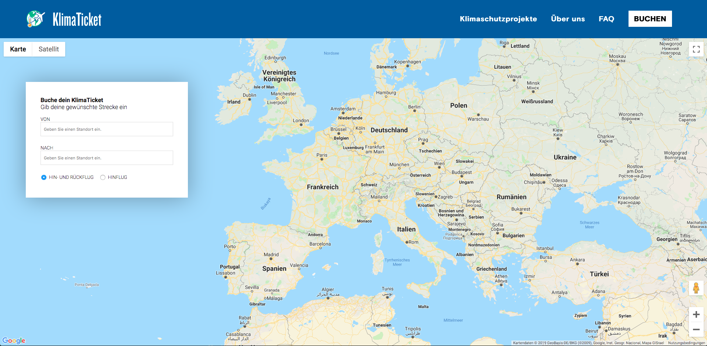

Maps Calculate CO2
============================

This repository holds the code developed together with representatives 
of [SOLAFRICA](https://solafrica.ch/) during the Hackathon at the RaiseNow Inspire 2019.

## Getting Started

1. Clone this repo
2. Adjust your Google Maps API Key in `index.tsx`
3. Adjust the URL to your Tamaro in `index.tsx` defined at `tamaro_url`.
3. Run `npm run dev` and check in your local browser whether everything works out
4. Run `npm run prod` and put the generated files from `dist` into your webserver.
